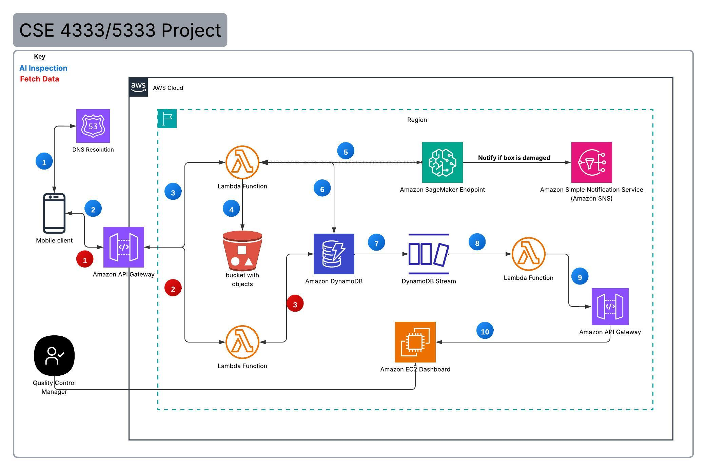

# ***AI Inspector*** : AI-Powered Visual Inspection System

## Architecture Diagram

---

### 🔍 WHAT — The Problem & Our Solution

Visual inspection is an important part of quality control in industries such as manufacturing, logistics, retail, agriculture, and food production. Many inspections are performed manually, which can be time-consuming, inconsistent, and difficult to scale. Our project, ***AI Inspector***, proposes a cloud-based AI visual inspection system that uses computer vision to automatically analyze images and identify potential defects, damage, or other undesirable conditions.

### How It Works

The system will allow an image to be captured from a mobile application and submitted to a cloud-based backend for AI inference. The trained model will classify the image and return an inspection result. Based on the result, the system can generate notifications and display inspection information on a real-time web dashboard.

> 📱 **Capture Image** → ☁️ **Cloud Processing** → 🤖 **AI Inspection** → 📊 **Real-Time Results** → 🔔 **Notification**

### 📦 Proof of Concept: Package Damage Detection

For our initial proof of concept, we will train the system to inspect packages and classify them as ⚠️ **DAMAGED** or ✅ **ACCEPTABLE**. Package inspection is only the demonstration use case; the overall architecture is intended to support additional AI inspection applications by using models trained for different inspection tasks.

---

###  👥 WHO — Target Audience
***AI Inspector*** is intended for organizations that perform repetitive visual inspections, including:

- 🏭 Manufacturing companies
- 🏢 Warehouses and distribution centers
- 🚚 Logistics and shipping companies
- 🛒 Retailers
- 🍎 Food producers
- 🔍 Quality-control teams

 The platform could also benefit smaller organizations that want to introduce automated inspection without developing an entire computer-vision infrastructure from scratch.

---

### 💡 WHY — Motivation

Imagine a warehouse processing **thousands of packages every day**.

Employees must identify crushed, opened, or otherwise damaged packages before they continue through the operation. As volume increases, manually inspecting every item becomes difficult to perform quickly and consistently.

AI-assisted inspection provides an opportunity to automate part of this process.

Instead of relying entirely on human observation, an AI model can provide **fast, repeatable, and measurable inspection results**, while employees focus their attention on items requiring further review.

---
### 🚀 VALUE — Beyond a Single Inspection

***AI Inspector*** demonstrates how multiple technologies can work together as one complete inspection platform:

- 🤖 Artificial Intelligence
- 👁️ Computer Vision
- ☁️ Cloud Computing
- 📱 Mobile Applications
- ⚡ Event-Driven Processing
- 🔔 Automated Notifications
- 📊 Real-Time Analytics

Instead of designing the solution around one specific object, the platform is designed as a reusable architecture that can potentially support multiple inspection scenarios.

---

The initial package-damage use case will demonstrate the concept by identifying damaged packages and automatically reporting the inspection result. In the future, the same approach could be adapted for:
- 🏭 Manufacturing defect detection
- 🍎 Food-quality inspection
- 🔧 Equipment inspection
- 📦 Product quality control
- 🌱 Agricultural inspection
- 🔍 Other visual inspection tasks

**Group Members:** 
- Marvin Wellington Marvinwel@yahoo.com
- Fallou Samb
- Tunji Oluwataki
- Abel Sanchez

### Project Management tool: 
    Trello
### UI Design ProtoType:
    Figma
### Architecture Diagram
    lucid
